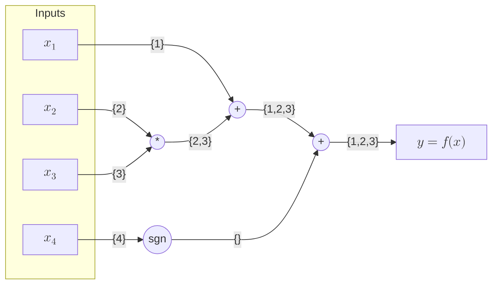

# How SparseConnectivityTracer works

!!! warning "Internals may change"
    The developer documentation might refer to internals which can change without warning in a future release of SparseConnectivityTracer.
    Only functionality that is exported or part of the [user documentation](@ref api) adheres to semantic versioning.


SparseConnectivityTracer (SCT) works by pushing `Real` number types called tracers through generic functions using operator overloading.
Currently, two tracer types are provided:

* [`GradientTracer`](@ref SparseConnectivityTracer.GradientTracer): used for Jacobian sparsity patterns
* [`HessianTracer`](@ref SparseConnectivityTracer.HessianTracer): used for Hessian sparsity patterns

When used alone, these tracers compute [**global** sparsity patterns](@ref TracerSparsityDetector).
Alternatively, these can be used inside of a dual number type [`Dual`](@ref SparseConnectivityTracer.Dual), 
which keeps track of the primal computation and allows tracing through comparisons and control flow.
This is how [**local** spasity patterns](@ref TracerLocalSparsityDetector) are computed.

!!! tip "Tip: SparseConnectivityTracer as binary ForwardDiff"
     SparseConnectivityTracer's `Dual{T, GradientTracer}` can be thought of as a binary version of [ForwardDiff](https://github.com/JuliaDiff/ForwardDiff.jl)'s own `Dual` number type.
     This is a good mental model for SparseConnectivityTracer if you are already familiar with ForwardDiff and its limitations.


## Index sets

Let's take a look at a scalar function $f: \mathbb{R}^n \rightarrow \mathbb{R}$.
For a given input $\mathbf{x} \in \mathbb{R}^n$, 
the gradient of $f$ is defined as $\left(\nabla f(\mathbf{x})\right)_{i} = \frac{\partial f}{\partial x_i}$ 
and the Hessian as $\left(\nabla^2 f(\mathbf{x})\right)_{i,j} = \frac{\partial^2 f}{\partial x_i \partial x_j}$. 

Sparsity patterns correspond to the mask of non-zero values in the gradient and Hessian.
Instead of saving the values of individual partial derivatives, they can efficiently be represented by the set of indices correponding to non-zero values:

* Gradient patterns are represented by sets of indices $\left\{i      \;\big|\; \left(\nabla f(\mathbf{x})\right)_{i}     \neq 1\right\}$
* Hessian patterns are represented by sets of index tuples  $\left\{(i, j) \;\Big|\; \left(\nabla^2 f(\mathbf{x})\right)_{i,j} \neq 1\right\}$

## Motivating example

Let's take a look at the computational graph of the equation $f(\mathbf{x}) = x_1 + x_2x_3 + \text{sgn}(x_4)$,
where $\text{sgn}$ is the [sign function](https://en.wikipedia.org/wiki/Sign_function):



To obtain a sparsity pattern, each scalar input $x_i$ gets seeded with a corresponding singleton index set $\{i\}$ [^1]. 
Since addition and multiplication have non-zero derivatives with respect to both of their inputs, 
the resulting scalar values accumulate and propagate their index sets (annotated on the edged of the graph).
The sign function has zero derivatives for any input value. It therefore doesn't propagate the index set ${4}$ corresponding to the input $x_4$.

[^1]: since $\frac{\partial x_i}{\partial x_j} \neq 0$ iff $i \neq j$

The resulting **global** gradient sparsity pattern $\left(\nabla f(\mathbf{x})\right)_{i} \neq 1$ for $i$ in $\{1, 2, 3\}$ matches the analytical gradient

```math 
\nabla f(\mathbf{x}) = \begin{bmatrix}
    \frac{\partial f}{\partial x_1} \\
    \frac{\partial f}{\partial x_2} \\
    \frac{\partial f}{\partial x_3} \\
    \frac{\partial f}{\partial x_4}
\end{bmatrix}
=
\begin{bmatrix}
    1 \\
    x_3 \\
    x_2 \\
    0
\end{bmatrix} \quad .
```

Note that the **local** sparsity pattern could be more sparse in case $x_3$ and/or $x_2$ are zero.
Computing such local sparsity patterns requires [`Dual`](@ref SparseConnectivityTracer.Dual) numbers with information about the primal computation. 
These can be used to evaluate the **local** differentiability of operations like multiplication.

## Toy implementation

As mentioned above, SCT uses operator overloading to keep track of index sets.
Let's start by implementing our own `MyGradientTracer` type:

```@example toytracer
struct MyGradientTracer
    indexset::Set
end
```

We can now overload operators from Julia Base using our type:

```@example toytracer
import Base: +, *, sign

Base.:+(a::MyGradientTracer, b::MyGradientTracer) = MyGradientTracer(union(a.indexset, b.indexset))
Base.:*(a::MyGradientTracer, b::MyGradientTracer) = MyGradientTracer(union(a.indexset, b.indexset))
Base.sign(x::MyGradientTracer) = MyGradientTracer(Set()) # return empty index set
```

Let's create a vector of tracers to represent our input and evaluate our function with it:

```@example toytracer
f(x) = x[1] + x[2]*x[3] * sign(x[4])

xtracer = [
    MyGradientTracer(Set(1)),
    MyGradientTracer(Set(2)),
    MyGradientTracer(Set(3)),
    MyGradientTracer(Set(4)),
]

ytracer = f(xtracer)
```

Compared to this toy implementation, SCT adds some utilities to automatically create `xtracer` and parse the output `ytracer` into a sparse matrix, which we will omit here.

[`jacobian_sparsity(f, x, TracerSparsityDetector())`](@ref TracerSparsityDetector) calls these three steps of (1) tracer creation, (2) function evaluation and (3) output parsing in sequence:

```@example toytracer
using SparseConnectivityTracer

x = rand(4)
jacobian_sparsity(f, x, TracerSparsityDetector())
```

! tip "From gradients to Jacobians"
    

